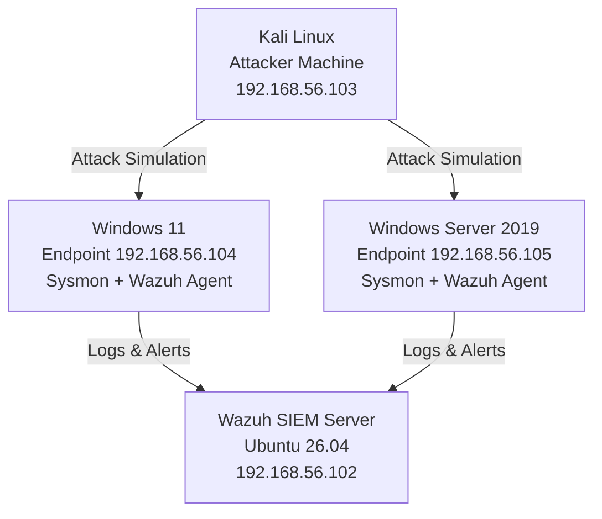
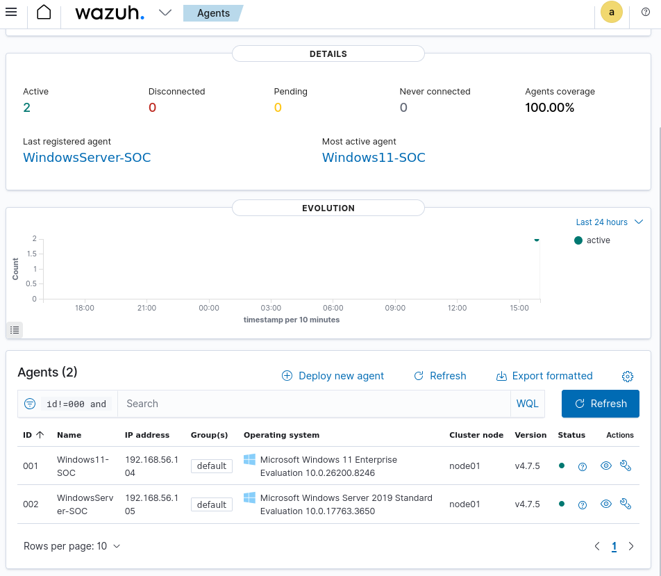
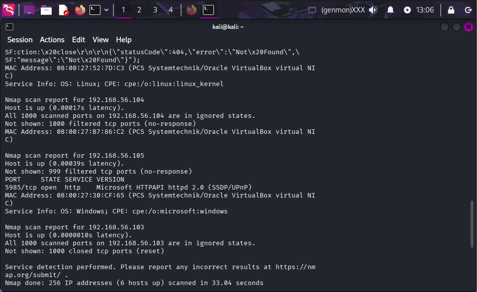
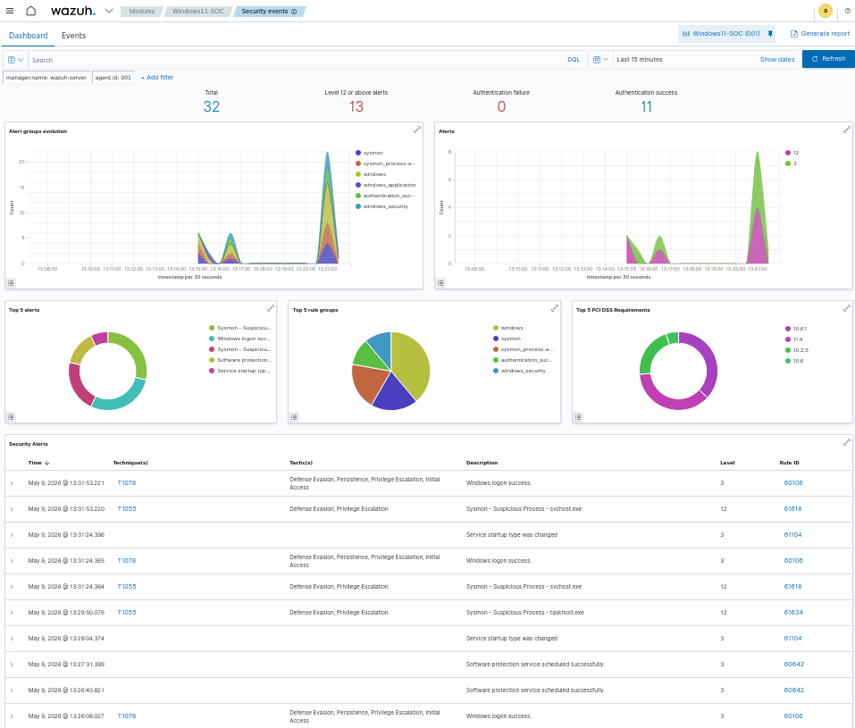
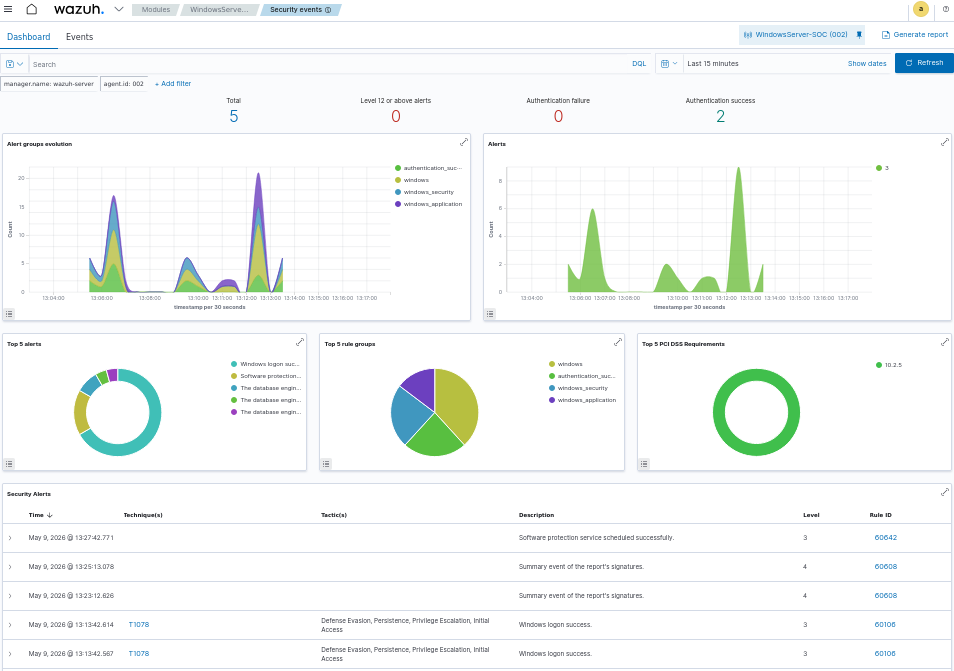
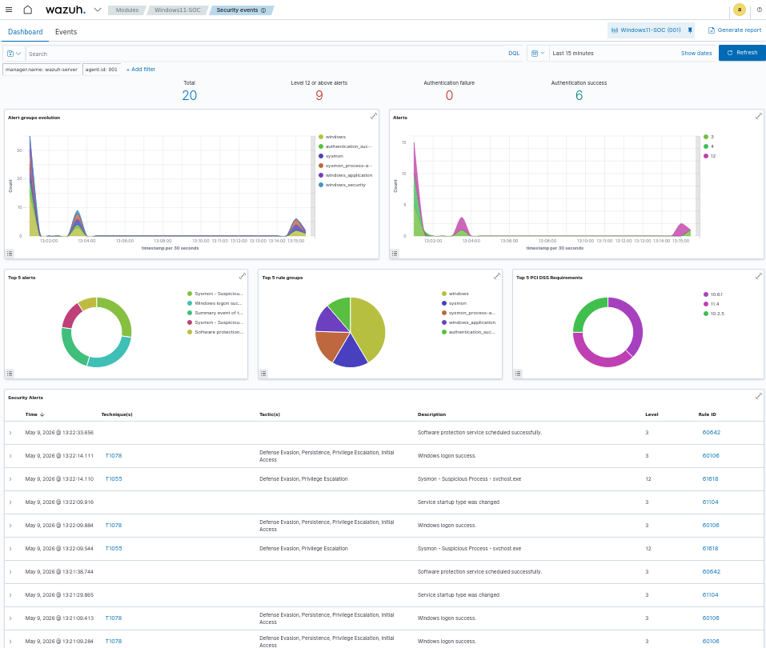

## 🛡️ SOC-Lab — Home Security Operations Center 🛡️

A hands-on cybersecurity home lab simulating real world SOC workflows using open source tools.

## 📌 Overview
This project documents the setup and operation of a personal SOC lab built using VirtualBox, Wazuh SIEM, Sysmon and multiple virtual machines.
The goal is to simulate real attack scenarios, detect threat and practice incident response, all in a safe, isolated environment.

## Lab Architecture

 
## 🖥️ Virtual Machines 
| VM Name | OS | Role | IP Address |
|----------|------------------|------------------------------|----------------|
| Wazuh Server | Ubuntu 26.04 | SIEM & Manager | 192.168.56.102 |
| Attacker | Kali Linux | Red Team | 192.168.56.103 |
| Endpoint 1 | Windows 11 | Monitored Client | 192.168.56.104 |
| Endpoint 2 | Windows Server 2019 | Monitored Server | 192.168.56.105 | 

## Tools & Technologies
| Tool | Purpose |
|------|--------------------------------------------------------------|
| VirtualBox | Virtualization platform  |
| Wazuh | SIEM, IDS, and Log Analysis  |
| Sysmon | Windows event telemetry  |
| Kali Linux | Attack simulation  |
| Nmap | Network scanning  |

## ✅ Progress 
- [x] 4 VMs configured and running
- [x] Host-Only network configured for isolated lab environment
- [x] Wazuh SIEM installed and operational
- [x] SSH configured between Kali and Wazuh Server
- [x] Windows 11 & Windows Server 2019 connected as agents
- [x] Sysmon deployed on Windows endpoints
- [x] First attack simulated: Nmap network scan
- [x] Alerts successfully triggered in Wazuh Dashboard
- [ ] Attack scenario documentation
- [ ] Custom detection rules
- [ ] Incident response playbooks

## 🔴 Attack Scenarios 

### 1. Nmap Network Scan ✅
**Description:** Simulated a network reconnaissance scan from Kali targeting Windows endpoints.

**Command used:**
```bash
nmap -sV 192.168.56.0/24
```

**Result:**
- Wazuh detected the scan and triggered alerts
- Severity Level 12+ alerts generated
- Sysmon detected suspicious process activity
- MITRE ATT&CK T1055 technique identified

---

### 2. Targeted Nmap Scan ✅
**Description:** Focused scan on Windows 11 endpoint to identify open ports and OS details.

**Command used:**
```bash
nmap -sS -sV -O 192.168.56.104
```

**Result:**
- Windows 11 detected with filtered ports
- Wazuh generated additional Sysmon alerts
- Defense Evasion and Privilege Escalation tactics identified

---

### 3. Brute Force Attack 
*Coming soon*

### 4. Metasploit Exploitation 
*Coming soon*

## 🚀 Getting Started 

### Prerequisites 
- VirtualBox 7.2.6
- Minimum 16GB RAM
- Minimum 200GB free disk space

### Wazuh Installation 
> Run on Ubuntu Server (Wazuh VM)
```bash
curl -sO https://packages.wazuh.com/4.7/wazuh-install.sh
sudo bash ./wazuh-install.sh -a --ignore-check
```

### Wazuh Agent Installation (Windows)
> Run on Windows PowerShell as Administrator
```powershell
Invoke-WebRequest -Uri https://packages.wazuh.com/4.x/windows/wazuh-agent-4.7.5-1.msi -OutFile ${env.tmp}\wazuh-agent
msiexec.exe /i ${env.tmp}\wazuh-agent /q WAZUH_MANAGER='192.168.56.102' WAZUH_AGENT_NAME='Windows11-SOC'
NET START WazuhSvc
```

### Sysmon Installation 
> Run on Windows PowerShell as Administrator
```powershell
Invoke-WebRequest -Uri https://download.sysinternals.com/files/Sysmon.zip -OutFile C:\Sysmon.zip
Expand-Archive C:\Sysmon.zip -DestinationPath C:\Sysmon
C:\Sysmon\Sysmon64.exe -accepteula -i
```
### Configure Sysmon in Wazuh Agent
> Add to ossec.conf before </ossec_config>
```xml

  eventchannel
  Microsoft-Windows-Sysmon/Operational

```
> Then restart the service:
```powershell
Stop-Service -Name WazuhSvc -Force
Start-Service -Name WazuhSvc
```

## 📁 Repository Structure

```text
SOC-Lab/
├── README.md
├── screenshots/
│   ├── wazuh-dashboard.png
│   ├── nmap-scan.png
│   └── alerts.png
├── configs/
│   └── ossec-conf-sysmon.xml
└── scenarios/
    ├── 01-nmap-scan.md
    └── 02-targeted-scan.md
```

## 📊 Screenshots 

### 1. Wazuh Agents Active


### 2. Nmap Scan Results


### 3. Wazuh Dashboard with Alerts



### 4. Security Alerts - MITRE ATT&CK

