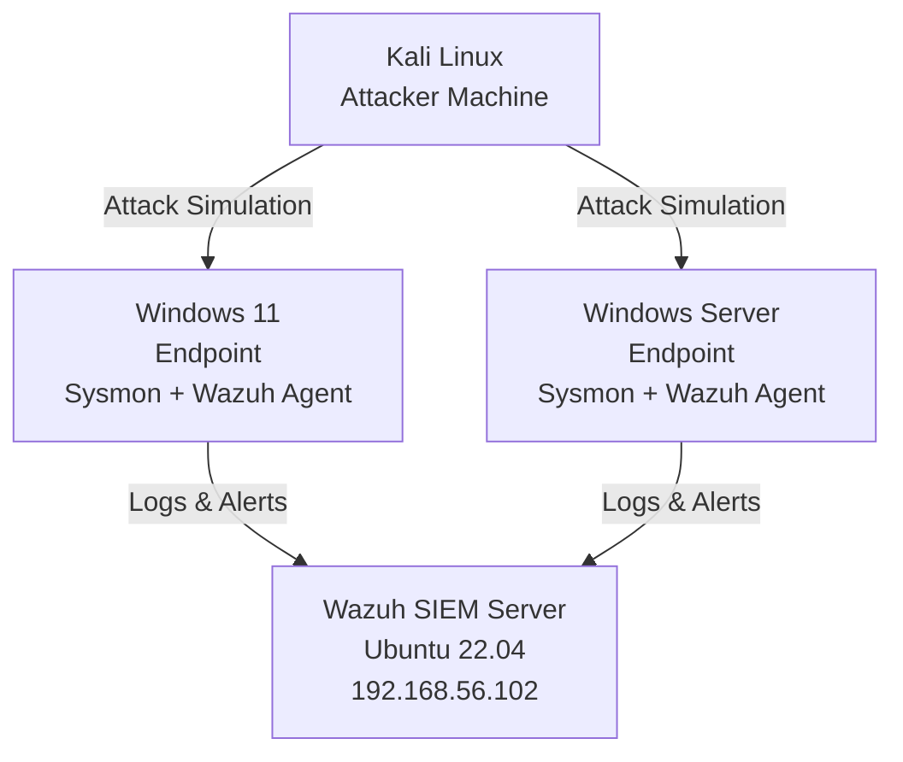

## 🛡️ SOC-Lab — Home Security Operations Center 🛡️

A hands-on cybersecurity home lab simulating real world SOC workflows using open source tools.

## 📌 Overview
This project documents the setup and operation of a personal SOC lab built using VirtualBox, Wazuh SIEM, Sysmon and multiple virtual machines.
The goal is to simulate real attack scenarios, detect threat and practice incident response, all in a safe, isolated environment.

## Lab Architecture

 
